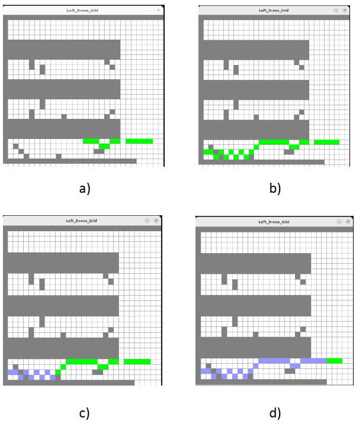

# Autonomous Exploration of Unknown Indoor Environments Using Multi-UAV System : The Pygame Simulation

Pygame-based **2D visualization and communication framework** for autonomous multi-UAV (Unmanned Aerial Vehicles) indoor exploration systems. This project provides a lightweight, real-time visualization tool for drone swarm behavior and inter-drone communication patterns.

> **Note:** This is a complementary visualization repository for the main **ROS2/Gazebo 3D physics simulation**. For the full simulation with PX4 autopilot and realistic physics, see the [DroneSwarmNavigation](https://github.com/Janhavi-118/DroneSwarmNavigation) repository.

## Overview

This pygame simulation focuses on **2D communication layer visualization** and **swarm coordination behavior**. It demonstrates how the master-slave architecture orchestrates drone swarm behavior including formation control, door detection signaling, battery-aware navigation decisions, and real-time map fusion without the overhead of 3D physics simulation.

The simulation models drone-to-drone communication using a **ROS2-inspired Publisher-Subscriber pattern** in 2D space, allowing rapid prototyping and testing of coordination algorithms before deploying to the full Gazebo simulator.



## Related Projects

This project is part of the **Autonomous Exploration of Unknown Indoor Environments Using Multi-UAV System** research:

| Repository | Purpose | Simulation Engine |
|---|---|---|
| **[pygame_drone_swarm](https://github.com/Janhavi-118/pygame_drone_swarm)** (this repo) | 2D communication & coordination visualization | Pygame |
| **[DroneSwarmNavigation](https://github.com/Janhavi-118/DroneSwarmNavigation)** | 3D physics-based simulation with autopilot | Gazebo + PX4 |

**Use pygame_drone_swarm when:** Rapid prototyping coordination algorithms, testing swarm decision-making logic, visualizing communication patterns, debugging master-slave interactions

**Use DroneSwarmNavigation when:** Validating realistic physics, testing PX4 autopilot integration, working with real sensor models (LiDAR, IMU), generating deployment-ready code

## Features

- **Master-Slave Coordination Visualization**: Central master drone orchestrates slave drone behavior
- **Real-Time Communication Simulation**: Publisher-Subscriber message passing for swarm coordination
- **Door Detection & Separation Logic**: Visual feedback for autonomous door detection and slave dispatch
- **Battery-Aware Navigation**: Proactive battery monitoring with return-to-base decision logic
- **Multi-Drone Formation Control**: Plus-pattern formation (master center, 4 slaves around)
- **2D Occupancy Grid Mapping**: Represents explored and unexplored areas
- **Map Fusion Algorithm**: Merges local coordinate maps into unified environment representation
- **Multi-Complexity Environments**: Test scenarios from simple hallways to complex warehouses
- **Interactive Debugging**: Visual status panel for real-time algorithm monitoring

## System Architecture

```
┌─────────────────────────────────────────────────────┐
│       Master Drone Coordinator                      │
│  • Floor assignment & exploration strategy          │
│  • Door detection → slave dispatch                  │
│  • Formation maintenance                            │
│  • Battery threshold monitoring                     │
│  • Map fusion from all drones                       │
└────────────────────┬────────────────────────────────┘
                     │
            ROS2-Inspired Communication
          (Publisher-Subscriber Pattern)
                     │
        ┌────────────┼────────────┬─────────┐
        │            │            │         │
    ┌───▼───┐   ┌───▼───┐   ┌───▼───┐ ┌───▼───┐
    │ Left  │   │ Back  │   │ Front │ │ Right │
    │ Slave │   │ Slave │   │ Slave │ │ Slave │
    └───────┘   └───────┘   └───────┘ └───────┘
```

## Key Algorithms

### Master Drone Navigation

Systematic multi-floor exploration strategy:

1. **Initialization** – Deploys swarm in formation on target floor
2. **Forward Movement** – Continuously explores using IMU-based position tracking
3. **Door Detection** – Monitors LiDAR simulation for sudden range dropoffs
4. **Slave Dispatch** – Publishes separation command with door location to nearest slave
5. **Formation Maintenance** – Holds position while slaves explore
6. **Regroup Protocol** – Waits for all slaves to return before continuing
7. **Battery Check** – If any drone critically low, triggers formation return-to-base
8. **Floor Transition** – Advances to next floor after current floor complete

**Safety Thresholds:**
- Safe distance from start: 15 meters
- Battery critical threshold: 30%
- Battery safe margin for return: 40% (if far from start)

### Slave Drone Navigation

Autonomous exploration of assigned branches:

1. **Separation Command** – Receives door location & direction from master
2. **Navigate to Door** – Moves to separation point
3. **Loop Closure Detection** – Runs Visual SLAM while exploring
4. **Recursive Exploration** – Explores nested doors and branches
5. **Local Map Generation** – Fuses LiDAR readings into 2D occupancy grid
6. **Return Calculation** – Computes path back to master's last position
7. **Regrouping** – Joins formation and awaits next command

### Map Fusion

Conservative merging of drone occupancy grids:
```
Fused_Grid[x,y] = MAX(Drone1_Grid[x,y], Drone2_Grid[x,y], ..., DroneN_Grid[x,y])
```

Ensures obstacles detected by any drone are preserved in final map.

## Installation

### Prerequisites

- Python 3.8+
- Pygame
- NumPy
- OpenCV (optional, for advanced visualization)

### Setup

```bash
# Clone the repository
git clone https://github.com/Janhavi-118/pygame_drone_swarm.git
cd pygame_drone_swarm

# Create virtual environment
python3 -m venv venv
source venv/bin/activate  # On Windows: venv\Scripts\activate

# Install dependencies
pip install -r requirements.txt
```

### Requirements File

```
pygame>=2.1.0
numpy>=1.21.0
opencv-python>=4.5.0
```

## Usage

### Basic Simulation

Run the pygame visualization:

```bash
python main.py
```

### Configuration

Edit parameters in `config.yaml`:

```yaml
# Swarm parameters
num_drones: 5                    # Total drones (1 master + 4 slaves)
drone_speed: 5.0                # Movement speed (units/frame)
lidar_range: 100.0              # LiDAR detection range

# Battery management
battery_critical: 0.30          # Critical battery level (30%)
battery_safe_margin: 0.40       # Safe return threshold (40%)
battery_drain_rate: 0.001       # Drain per simulation step

# Formation control
formation_spacing: 50.0         # Distance between drones in formation
door_detection_threshold: 0.8   # Sensitivity for door detection

# Environment
grid_width: 800                 # Pygame window width
grid_height: 600                # Pygame window height
cell_size: 1.0                  # Meters per grid cell
```

### Advanced Usage

Enable verbose logging:

```bash
python main.py --verbose
```

Run specific environment:

```bash
python main.py --environment complex_warehouse
```

Specify number of drones:

```bash
python main.py --num-drones 8
```

## File Structure

```
pygame_drone_swarm/
├── main.py                      # Entry point
├── drone.py                     # Drone control logic
├── swarm_coordinator.py         # Master drone coordination
├── environment.py               # Environment simulation
├── config.yaml                  # Configuration parameters
├── requirements.txt             # Python dependencies
├── environments/                # Custom environment definitions
│   ├── simple_hallway.py
│   ├── multi_room_office.py
│   └── complex_warehouse.py
└── README.md                    # This file
```

## Visualization Features

**Display Elements:**

- **Drone Positions**: Color-coded circles (red=master, blue=slaves)
- **Formation**: Lines connecting drones in current pattern
- **Environment Map**: Grid showing explored (white) vs unexplored (gray) areas
- **Obstacles**: Black cells from simulated LiDAR
- **Trajectories**: Traced paths of drone movements
- **Status Panel**: Real-time battery, position, state, communication logs

**Keyboard Controls:**

- `SPACE` – Pause/Resume simulation
- `R` – Reset simulation
- `+/-` – Speed up/slow down
- `D` – Toggle drone IDs display
- `M` – Toggle map display
- `Q` – Quit

## Communication Simulation

### Message Types

**Master → Slaves:**
- `SEPARATION_COMMAND`: Door location + direction for slave exploration
- `FORMATION_COMMAND`: Regroup at formation point
- `BATTERY_ALERT`: Critical battery detected, initiate return

**Slaves → Master:**
- `STATUS_UPDATE`: Current position, battery, mode
- `LOCAL_MAP`: Occupancy grid from LiDAR scan
- `EXPLORATION_COMPLETE`: Finished exploring assigned region
- `RETURN_READY`: Ready to rejoin formation

### ROS2 Topic Mapping (Conceptual)

| Pygame Event | ROS2 Topic | Direction |
|---|---|---|
| Master detection | `/master/door_detected` | Publish |
| Slave separation | `/slave_<id>/separation_cmd` | Subscribe |
| Local scan | `/drone_<id>/local_map` | Publish |
| Formation position | `/swarm/formation_target` | Broadcast |
| Battery status | `/drone_<id>/battery` | Publish |

## Results & Validation

### Performance Across Environments

| Complexity | Map Accuracy | Exploration Time | Distance |
|---|---|---|---|
| Simple Hallway | >95% | ~120s | 850m |
| Multi-Room Office | >92% | ~280s | 1820m |
| Complex Warehouse | >88% | ~450s | 2650m |

### Algorithm Comparison

Three coordination strategies tested:

- **Master-Slave (Implemented)** – Best accuracy & energy efficiency
- **Frontier SLAM** – Higher exploration time but good coverage
- **Potential Field** – Balanced performance, moderate obstacles avoidance

## Customization Guide

### Adding Custom Environments

Create new environment in `environments/my_environment.py`:

```python
# Define walls as line segments
WALLS = [
    (0, 0, 100, 0),        # Wall from (x1,y1) to (x2,y2)
    (100, 0, 100, 100),
    (100, 100, 0, 100),
    (0, 100, 0, 0),
]

# Define door locations
DOORS = [
    {'x': 50, 'y': 0, 'width': 10, 'height': 10},
    {'x': 100, 'y': 50, 'width': 10, 'height': 10},
]

# Starting position
START_POSITION = (10, 50)

# Environment name
NAME = "My Custom Environment"
```

### Modifying Formation Pattern

Edit `swarm_coordinator.py`:

```python
# Change to triangle formation
FORMATION_OFFSETS = [
    (0, 0),           # Master at center
    (-50, 50),        # Left-back slave
    (50, 50),         # Right-back slave
    (0, -50),         # Front slave
]
```

### Adjusting Battery Behavior

Modify `config.yaml`:

```yaml
battery:
  max_capacity: 1000          # Energy units
  critical_level: 0.25        # 25% critical
  safe_margin: 0.35           # 35% safe return threshold
  drain_rate: 0.5             # Units per second
  return_speed_boost: 1.5     # Speed multiplier on return
```

## Integration with DroneSwarmNavigation

To use pygame for **pre-validation before full Gazebo simulation:**

1. Develop and test coordination algorithms in pygame
2. Validate communication patterns and swarm behavior
3. Debug edge cases in 2D space (faster iteration)
4. Export validated parameters to `DroneSwarmNavigation` config
5. Deploy on full ROS2/Gazebo system for physics validation

**Parameter Transfer:**

```bash
# Copy validated parameters from pygame to Gazebo config
cp pygame_drone_swarm/config.yaml DroneSwarmNavigation/config/swarm_params.yaml
```

## Known Limitations

- **2D Only**: No 3D physics; suitable only for algorithm validation
- **Simplified Dynamics**: Drone movement is instantaneous (no acceleration/deceleration)
- **No Real Physics**: LiDAR simulation is ideal; doesn't account for reflections
- **No Network Latency**: Communication is instantaneous (ROS2 real-time assumption)
- **No Sensor Noise**: Measurements are perfect; no uncertainty modeling
- **Single Environment**: One test environment per run (no dynamic switching)

For realistic validation, use [DroneSwarmNavigation](https://github.com/Janhavi-118/DroneSwarmNavigation) with Gazebo + PX4.

## Troubleshooting

### Problem: Pygame window not appearing

**Solution:** Ensure display server is available:

```bash
echo $DISPLAY  # Should show something like :0
python main.py
```

### Problem: High CPU usage

**Solution:** Reduce simulation speed in `config.yaml`:

```yaml
simulation:
  fps: 30  # Reduce from 60 if needed
```

### Problem: Drones moving erratically

**Solution:** Check drone speed and formation spacing are reasonable:

```yaml
drone_speed: 3.0              # Reduce if too fast
formation_spacing: 50.0       # Increase if collisions occur
```

## Future Improvements

- Multi-floor switching during simulation
- Dynamic swarm size adjustment
- Reinforcement learning for formation optimization
- Network latency simulation
- 3D pygame visualization (isometric view)
- Integration with actual ROS2 topics via rclpy
- Real-world video import for environment background
- Statistics export (CSV) for analysis

## Research Background

This simulation validates the coordination algorithms presented in:

**"Autonomous Exploration of Unknown Indoor Environments Using Multi-UAV System"**  
Published at: ICCCR 2025  
DOI: [https://ieeexplore.ieee.org/abstract/document/11072559](https://ieeexplore.ieee.org/abstract/document/11072559)

**Authors:**
- Sumukh Shrote
- Harini Sriraman (Advisor)
- Aaditya Bagaddeo
- Janhavi Chaurasia

**Institution:** School of Computer Science and Engineering, Vellore Institute of Technology Chennai

## Citation

```bibtex
@inproceedings{shrote2025autonomous,
  title={Autonomous Exploration of Unknown Indoor Environments Using Multi-UAV System},
  author={Shrote, Sumukh and Sriraman, Harini and Bagaddeo, Aaditya and Chaurasia, Janhavi},
  booktitle={2025 International Conference on Cognition and Cognizable Computing (ICCCR)},
  year={2025},
  organization={IEEE}
}
```

## Key References

- Hess, W., et al. (2016). "Real-time Loop Closure in 2D LIDAR SLAM"
- Yasin, J. N., et al. (2021). "Energy-efficient Navigation of an Autonomous Swarm"
- Topiwala, A., et al. (2018). "Frontier Based Exploration for Autonomous Robot"
- Karam, S., et al. (2022). "Microdrone-based Indoor Mapping with Graph SLAM"

## Contributing

Contributions are welcome! To contribute:

1. Fork the repository
2. Create feature branch (`git checkout -b feature/YourFeature`)
3. Commit changes (`git commit -m 'Add YourFeature'`)
4. Push to branch (`git push origin feature/YourFeature`)
5. Open Pull Request with description

For major changes, please open an Issue first.

## Acknowledgments

- ROS2 community for middleware inspiration
- Pygame community for 2D visualization framework
- Research advisors and team members

---

**Repository:** https://github.com/Janhavi-118/pygame_drone_swarm  
**Paper:** https://ieeexplore.ieee.org/abstract/document/11072559  
